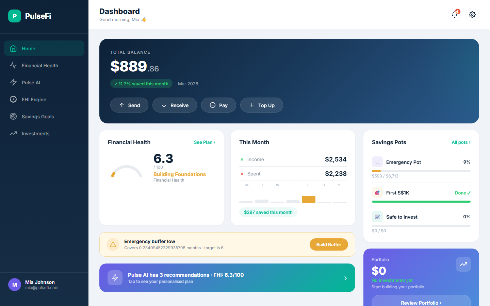
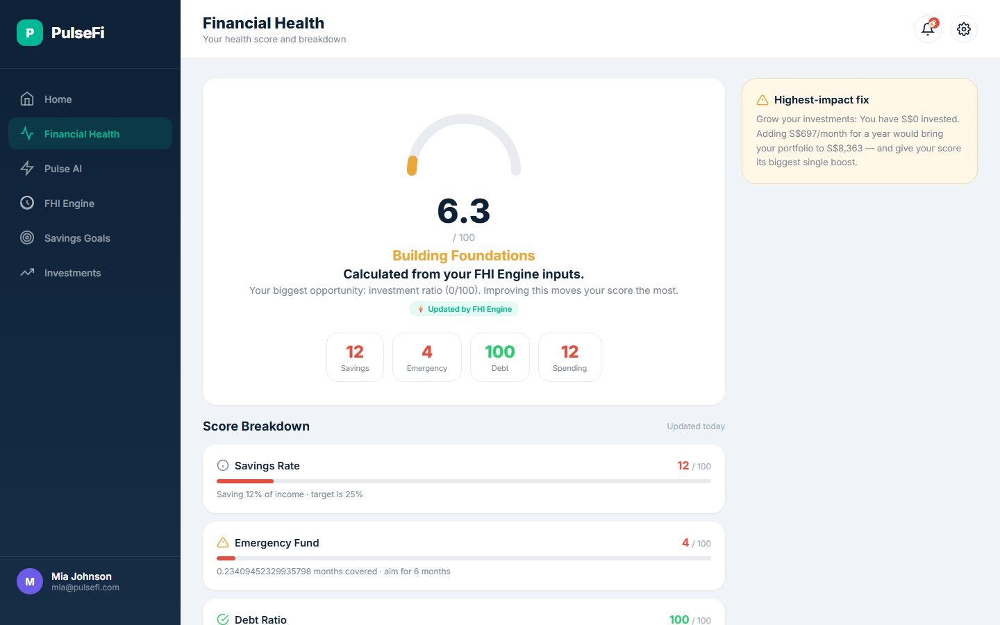
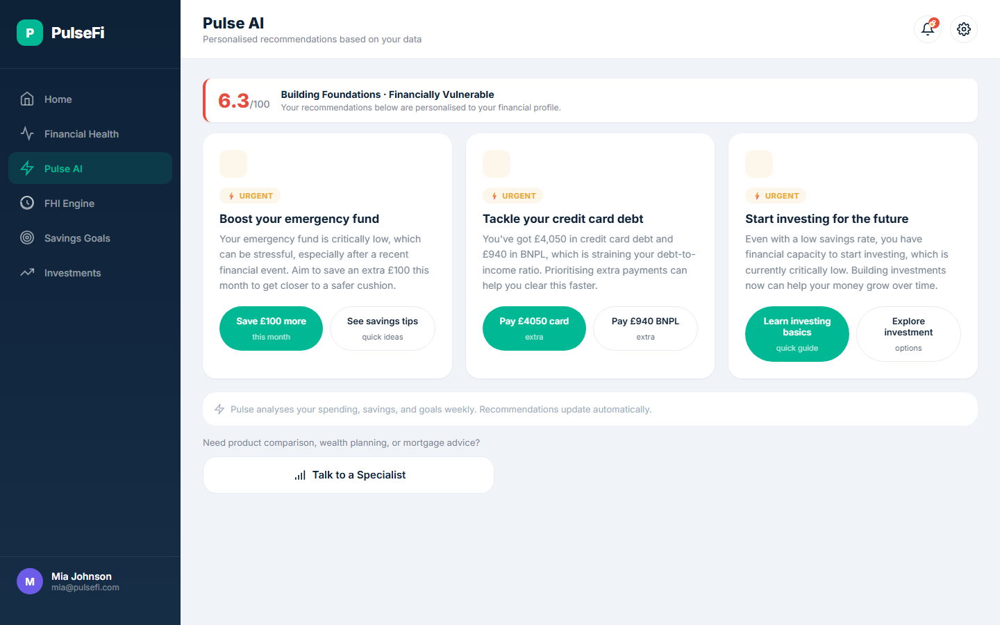
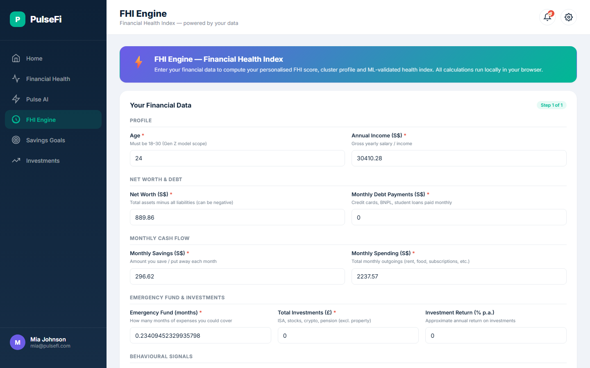
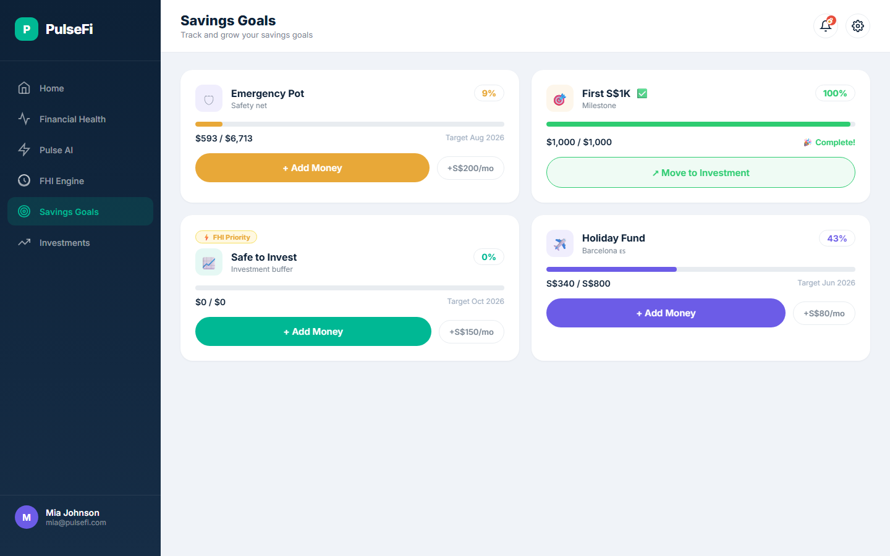
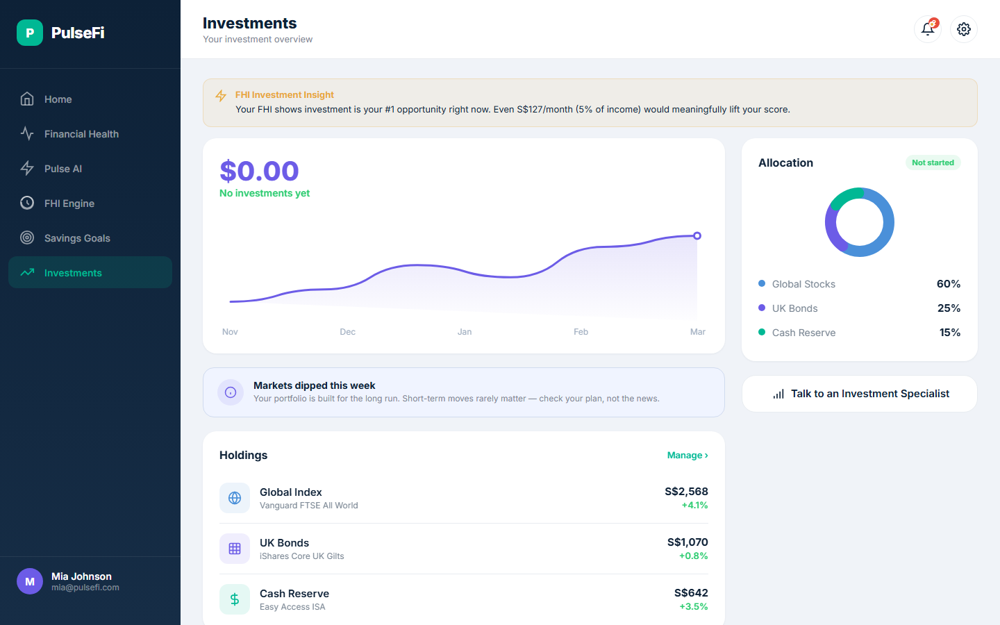

<div align="center">

# 💰 PulseFi

### A Smart Banking Dashboard Built for Gen Z

**Real financial data. Real AI recommendations. Zero backend.**

[](https://banking-mu-murex.vercel.app)
&nbsp;
[](https://banking-mu-murex.vercel.app)
&nbsp;
[](https://banking-mu-murex.vercel.app)

</div>

&nbsp;

PulseFi is a fully interactive banking dashboard designed specifically for 18 to 30 year olds in Singapore. It combines a real time banking UI, pre generated AI recommendations from Gemini, and a machine learning Financial Health Index engine — all running entirely in the browser with no backend, no build step, and no npm required.

Every button works. Every financial action updates your balance live, recalculates your financial health score, and syncs across all six screens instantly.

&nbsp;

## What It Looks Like

> **Screenshots coming soon** — clone the repo, open `http://localhost:8080`, and see it for yourself. Or just [click here to try the live demo](https://banking-mu-murex.vercel.app).

> To add screenshots: take captures of the six screens, save them as `screenshots/home.png`, `screenshots/health.png`, etc., and commit them. The image tags below will auto resolve.

<div align="center">

| Home Dashboard | Financial Health |
|:---:|:---:|
|  |  |

| Pulse AI Recommendations | FHI Engine |
|:---:|:---:|
|  |  |

| Savings Goals | Investments |
|:---:|:---:|
|  |  |

</div>

&nbsp;

## Try It Right Now

The fastest way to explore PulseFi is the live deployment on Vercel:

**[banking-mu-murex.vercel.app](https://banking-mu-murex.vercel.app)**

It loads a real synthetic user profile from a dataset of 2,000 Gen Z users in Singapore. You can switch between users by changing the `?user=GZ00001` parameter in the URL. Go ahead, try `GZ00042` or `GZ00500`.

&nbsp;

## Six Screens, One Cohesive App

**Home** is your command centre. It shows your total balance in SGD, your savings pots (Emergency Pot, Holiday Fund, Safe to Invest), investment portfolio summary, monthly cash flow, and savings goals progress. From here you can send and receive money, pay bills, and top up your account — all with real balance updates.

**Financial Health** gives you a clear picture of how you are doing financially with your FHI score, colour coded ratings across debt, savings rate, spending habits, and investment activity.

**Pulse AI** surfaces three to five personalised recommendations powered by Gemini Flash Lite. They are pre generated from your actual user data and grouped by priority: Urgent, Ready to Act, and On Track.

**FHI Engine** is the brain of the whole app. You enter 11 financial inputs and it runs a 6 step machine learning pipeline right in your browser to generate your Financial Health Index score, assign you a money personality, and surface your top three financial opportunities.

**Savings Goals** tracks your progress toward the Emergency Pot, Holiday Fund, and investment milestone. You can add money to any goal directly from this screen, and your balance updates immediately.

**Investments** shows your full portfolio breakdown as a pie chart, your top holdings by value, and your overall return percentage.

&nbsp;

## Every Button Is Wired Up

This is not a static mockup. Here is what actually works:

* **Send Money** opens a modal where you enter a recipient and amount. Your balance drops instantly.
* **Receive Money** prompts for the incoming amount and updates your balance upward.
* **Pay Bills** deducts from your balance and logs the transaction.
* **Top Up** adds funds via a simulated card top up flow.
* **Add to Goals** moves money from your main balance into any savings pot.
* **Move to Investments** transfers a savings milestone directly into your portfolio.
* **Notifications** shows a live unread badge. Click to dismiss individual alerts.
* **Settings** toggles profile preferences and security options.

Every financial action also silently re runs the FHI Engine in the background and syncs the updated score across all six screens.

&nbsp;

## The FHI Score Explained

The Financial Health Index score is produced by a 6 step ML pipeline that runs entirely in the browser using pre computed weights from a real training run.

| Score | What It Means |
|:---:|:---|
| 25 and above | Financially Strong |
| 12 to 24 | On the Right Track |
| Below 12 | Building Foundations |

Scores intentionally skew lower than traditional financial indexes because **investments carry 59% of the total weight**. That weighting is backed by research showing investment behaviour is the strongest predictor of long term financial resilience for people aged 18 to 30.

**Step 1 — Preprocessing:** Validates age is between 18 and 30, fills missing values with medians, and removes outliers using the IQR × 1.5 method.

**Step 2 — Feature Standardisation:** Converts raw inputs into 8 normalised scores including Net Worth Ratio, Debt to Income, Savings Rate, Investment Ratio, Emergency Fund Coverage, Spending Ratio, Spending Volatility, and Behavioural Discipline.

**Step 3 — FHI Score Calculation:** Applies Logistic Regression (L1) coefficients trained on a `negative_event_30d` outcome label to produce both a Baseline FHI and an Enhanced FHI.

**Step 4 — XGBoost Validation:** Three pre computed XGBoost models compare raw features vs Baseline FHI vs Enhanced FHI. Model A (5 raw features) reached AUC 0.671. Model C (Enhanced FHI) achieved 42.9% precision.

**Step 5 — K Means Clustering:** Groups the user into one of four money personality archetypes — Financially Vulnerable, Developing, Stable, or Active Investor — using cluster centroids pre computed from the full 2,000 user dataset with K=4 (silhouette score 0.225).

**Step 6 — Persistence:** Results are written to localStorage and synced live to every screen. Any financial action triggers a silent recalculation.

&nbsp;

## Tech Stack

| Layer | What We Used |
|:---|:---|
| Frontend | HTML, CSS, Vanilla JavaScript |
| Charts | Canvas API (no library) |
| AI Recommendations | Google Gemini Flash Lite |
| FHI Algorithm | Logistic Regression (L1) + K Means |
| ML Validation | XGBoost (pre computed, weights hardcoded) |
| Dataset | 2,000 synthetic Gen Z profiles (Singapore) |
| Hosting | Vercel |

&nbsp;

## Run It Locally

No npm. No build step. No configuration. Just a local server:

```bash
git clone https://github.com/om-gorakhia/Banking-AI-advisor.git
cd Banking-AI-advisor
python -m http.server 8080
```

Then open `http://localhost:8080` in your browser. That is it.

&nbsp;

## Project Structure

```
Banking-AI-Advisor/
├── index.html                                  Single page app with all six screens
├── app.js                                      Navigation, user data rendering, Canvas charts
├── app-actions.js                              AppState, modals, all action button handlers
├── pulse-ai.js                                 AI recommendations loader
├── fhi-engine.js                               FHI algorithm engine (all 6 steps)
├── styles.css                                  Full design system + modal and toast styles
├── users.json                                  2,000 user profiles
├── recommendations.json                        Pre generated AI recommendations
├── fhi_engine_data.json                        Pre computed ML weights and cluster centroids
├── genz_fhi_master_dataset.xlsx                Source dataset (2,000 users, 33 columns)
├── genz_fhi_ml_input.xlsx                      ML ready features + label
└── scripts/
    ├── extract_fhi_weights.py                  Derives weights and centroids from datasets
    ├── generate_recommendations.py             Batch generates AI recs via Gemini
    ├── generate_users_json_for_frontend.py     Converts Excel to users.json
    └── .env.example                            Template for API key (never commit the real one)
```

&nbsp;

## Regenerating the Data (Optional)

To retrain the FHI model weights from the raw dataset:

```bash
cd scripts
pip install pandas scikit-learn xgboost openpyxl
python extract_fhi_weights.py
```

This overwrites `fhi_engine_data.json` with freshly computed weights, centroids, and model metrics.

To regenerate AI recommendations you need a Gemini API key:

```bash
cp scripts/.env.example scripts/.env
# Open scripts/.env and set GEMINI_API_KEY=your_key_here

python scripts/generate_users_json_for_frontend.py
python scripts/generate_recommendations.py
```

The `scripts/.env` file is in `.gitignore`. Your API key will never be committed.

&nbsp;

## Who Built This

PulseFi was built as a proof of concept for what a Gen Z focused banking experience could look like — personalised, transparent about financial health, and genuinely useful rather than just a pretty balance screen.

The whole thing runs in the browser with no cloud dependency, which means it is free to host, instant to load, and easy to fork.

&nbsp;

<div align="center">

Made with care and deployed on [Vercel](https://vercel.com) &nbsp;·&nbsp; [Try the live demo](https://banking-mu-murex.vercel.app)

</div>
